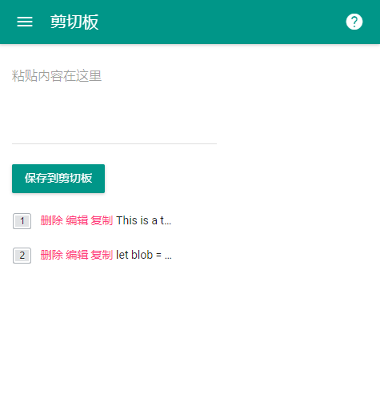

# clipboard-front

 

> a web clipboard.一个在线剪切板应用。

## 项目信息

* [项目主页](http://project.yunser.com/projects/undefined)
* [在线 Demo](undefined)
* 

如果觉得项目不错，可以给个星星。项目有 bug 可以到 [这里](https://github.com/yunser/undefined/issues) 提交问题。

## 开发构建

```bash
git clone https://github.com/yunser/undefined.git # 下载
cd undefined # 进入项目根目录
npm install # 安装依赖
npm run dev # 开发

# 构建
npm run build
```

# 截图



# 项目结构

```text
root
├─ README.md
├─ build # 构建流程配置
├─ config # 项目配置文件
├─ index.html # 在这里配置 CDN
├─ package.json
├─ src
│  ├─ App.vue
│  ├─ components # 通用组件
│  ├─ config # 项目配置文件
│  ├─ main.js
│  ├─ router # 路由
│  ├─ scss
│  ├─ util # 工具类
│  └─ views # 视图
└─ static # 静态资源目录
   └─ img # 图片
```

# 协议


